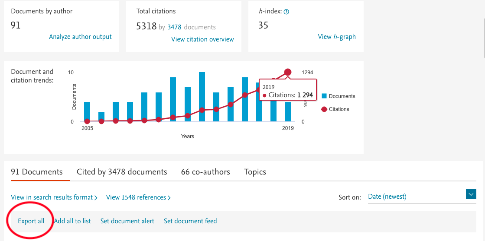
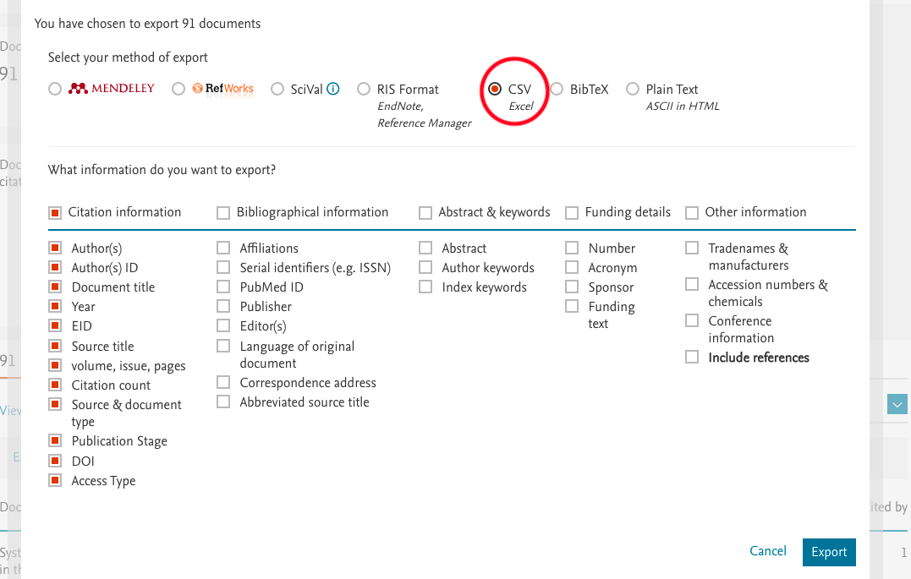
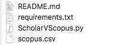
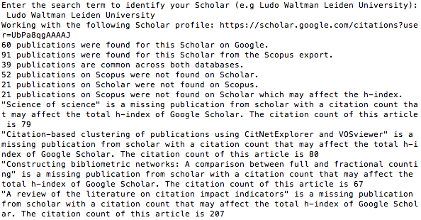

# ScholarVScopus

**About**

This python script is used to compare a list of publications exported from Scopus as a CSV format with a list of publications present on a Google Scholar profile. It notices that a publication may be titled slightly different across databases and uses a Levenshtein test to check whether the title is present. It determines the amount of publications that are present on one database and not the other as well as the citation count differences for publications which are present on both. The citation count comparisons are written to a file 'citation_counts.csv'.

As Scholar indexes many more publications, it is expected that the Scopus database should be missing more publications then the Scholar database (i.e the Scholar database should contain more publications for an author). It is also expected that the Scholar citation counts will be greater then that of the Scopus citation counts. If any article is missing from the Google Scholar database and it is likely to affect the H-index, that is, it has more citations then the current listed H-index then the publications are printed to the console. The code to search the Scholar database for the publication is present, however due to Google's rate limitations I this is commented out. The use of proxies may be required to prevent this rate limitation, further testing for this won't be conducted though.

***
**Usage**

***Step 1***
Export the publications from a Scopus profile to a CSV file

***Step 2***
Run the python script with the exported CSV file as "scopus.csv" in the working directory.

***Step 3***
Follow on-screen instruction to enter identifying search term for the author.

